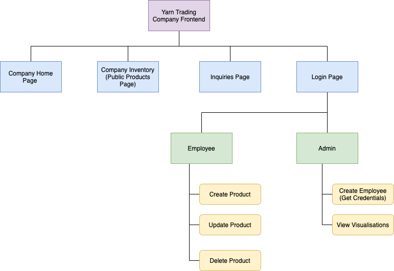
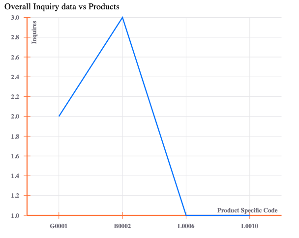
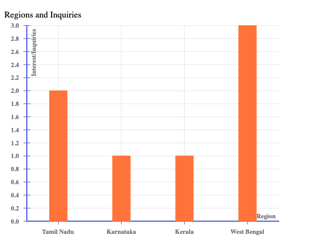
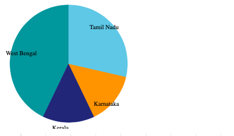
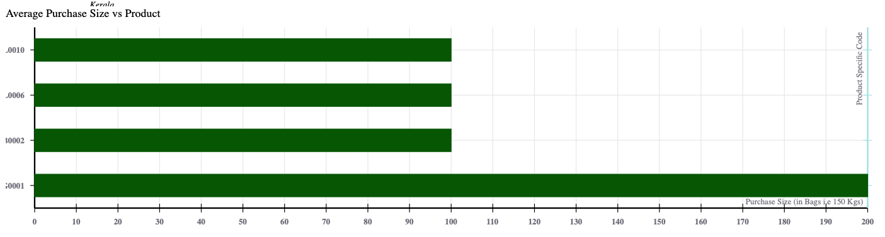
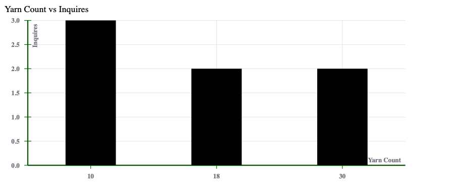

# Yarn Trading Company Working Frontend

An Inventory Management and Business Intelligence Web Application for a typical Small scale trading company in the textile industry. Analysis was done with respect to textile companies in the Erode region for this purpose. Please read the full report for more details.

Fall 2020 Project - MERN Stack Web Application for a small/medium scale Yarn Trading Company

## Why this Application?

In small scale textile companies, Inventory details are mostly stored via generic accounting software or even worse, handwritten documents. Sending samples of yarn or fabric manually via post to client base wastes resources. It is also wasted potential data for business intelligence. Through this web application we aim to create a web application where potential customers can look at the catalog of available end products, and inquire the company owners about cost or ask for a quote via the website. The catalog of inventory items can be managed and updated constantly by employees with an employee login. Another important feature, would be the data will be visualized with appropriate graphs for an admin user for business intelligence purposes.


ReactJS Frontend

1. Employee Dashboard ( CRUD Operations for Products)
2. Inquiry Page (Create Inquiry Form Submission )
3. Admin Dashboard ( Create Employee Account + Visualizations + Inquiry response)
4. Public Products Page (Only R, No CUD)
5. Public Home Page (Information about Company)

## Frontend flow



## Visualizations

Product Codes against Number of Inquiries



Inquiries and Regions





Products Average Purchase Size



Yarn Count and Inquiry



## Run locally

1. Download, Install and Run MongoDB. Check [this](https://docs.mongodb.com/manual/installation/) for more info. 


2. Clone Backend Repository and start the server (default port 4000)
```
git clone https://github.com/sanjitk7/yarnTradingCompanyBackendv1

npm install

npm run dev
```

3. Clone frontend Repository and start server

```
git clone https://github.com/sanjitk7/yarnTradingCompanyFrontendv2
```

*Note: Environment variables are defined for dev and production builds using env-cmd. The scripts are as follows*

To start development server (default port 3000)
```
npm run start-dev
```
To build and run it (default port 9000)

```
npm run build-dev
npm start
```

The production build is [deployed](http://sanjit-yarn-trading-frontend.herokuapp.com) as mentioned below.

*Note: To create a local build that uses deployed backend server on heroku and mongo atlas follow the same instructions but with start-prod and build-prod*
## Deployment

Find the backend server repository [here](https://github.com/sanjitk7/yarnTradingCompanyBackendv1)

Find a previous version of the frontend repository [here](https://github.com/sanjitk7/yarnTradingCompanyBackendv1)

Backend is hosted in a Express Server - http://sanjit-yarn-trading-frontend.herokuapp.com

Backend is hosted in a different Express Server - https://sanjit-yarn-trading-backend.herokuapp.com
